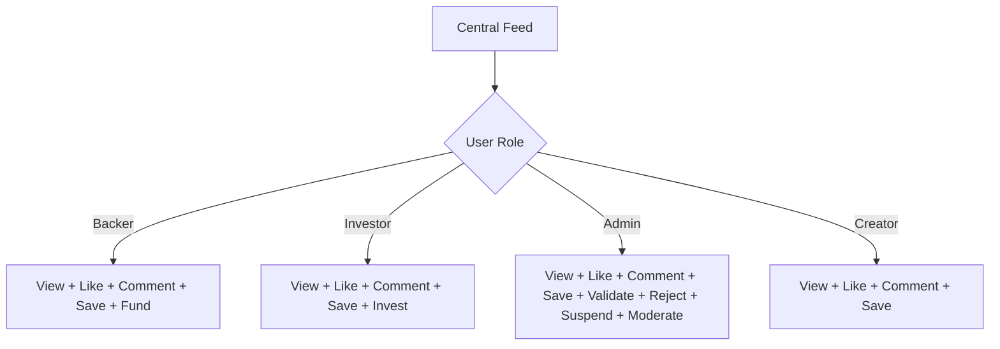

# Central Home Feed - Architecture Plan

## Overview
A unified, scrollable project feed accessible to all platform actors (Backers, Investors, Admins, Creators) with role-based interaction capabilities.

## Actor Roles & Permissions



### Permission Matrix

| Action | Backer | Investor | Admin | Creator |
|--------|--------|----------|-------|---------|
| View Projects | ✅ | ✅ | ✅ | ✅ |
| Like | ✅ | ✅ | ✅ | ✅ |
| Comment | ✅ | ✅ | ✅ | ✅ |
| Save | ✅ | ✅ | ✅ | ✅ |
| Fund Project | ✅ | ❌ | ❌ | ❌ |
| Invest in Project | ❌ | ✅ | ❌ | ❌ |
| Validate Project | ❌ | ❌ | ✅ | ❌ |
| Reject Project | ❌ | ❌ | ✅ | ❌ |
| Suspend Comment | ❌ | ❌ | ✅ | ❌ |
| Suspend User | ❌ | ❌ | ✅ | ❌ |
| Edit Project | ❌ | ❌ | ❌ | ✅ (Own only) |

## Component Architecture

### 1. ProjectFeed (Main Container)
```
/src/components/feed/
├── ProjectFeed.jsx          # Main feed container
├── ProjectCard.jsx          # Individual project card
├── ProjectActions.jsx       # Action buttons based on role
├── CommentSection.jsx       # Comments with moderation
├── FundModal.jsx           # Backing modal
├── InvestModal.jsx         # Investment modal
└── AdminActions.jsx        # Admin moderation panel
```

### 2. Feed Layout Design

```
┌─────────────────────────────────────────────────────────────┐
│  [Sidebar]  │  CENTRAL FEED                                │
│             │  ┌─────────────────────────────────────────┐ │
│  Dashboard  │  │  [Filter Bar: All | Funding | Investment]│ │
│  Browse     │  └─────────────────────────────────────────┘ │
│  My Projects│                                                │
│  ────────── │  ┌─────────────────────────────────────────┐ │
│  Feed (new) │  │  📊 PROJECT CARD                        │ │
│             │  │  ┌─────────────────────────────────────┐│ │
│             │  │  │ Cover Image + Category Badge        ││ │
│             │  │  ├─────────────────────────────────────┤│ │
│             │  │  │ Title                               ││ │
│             │  │  │ Creator Avatar | Name | Date        ││ │
│             │  │  ├─────────────────────────────────────┤│ │
│             │  │  │ 📝 Description (truncated)          ││ │
│             │  │  ├─────────────────────────────────────┤│ │
│             │  │  │ 💰 Progress Bar | $X,XXX of $XX,XXX ││ │
│             │  │  │ 👥 X backers | 🏷️ Category          ││ │
│             │  │  ├─────────────────────────────────────┤│ │
│             │  │  │ ❤️ 45 | 💬 12 | 🔖 Save             ││ │
│             │  │  ├─────────────────────────────────────┤│ │
│             │  │  │ [BACK PROJECT] OR [INVEST NOW]      ││ │
│             │  │  └─────────────────────────────────────┘│ │
│             │  │  [Admin: Validate | Reject | Edit]     │ │
│             │  └─────────────────────────────────────────┘ │
│             │                                                │
│             │  [Load More / Infinite Scroll]                │
└─────────────────────────────────────────────────────────────┘
```

### 3. Project Card Component Structure

```jsx
<ProjectCard>
  ├── <CardHeader>
  │     ├── <CoverImage />
  │     ├── <CategoryBadge />
  │     └── <CreatorInfo />
  ├── <CardBody>
  │     ├── <Title />
  │     ├── <Description />
  │     └── <FundingProgress />
  ├── <CardStats>
  │     ├── <BackersCount />
  │     ├── <DaysLeft />
  │     └── <FundingType />
  ├── <CardActions>
  │     ├── <LikeButton />
  │     ├── <CommentButton />
  │     ├── <SaveButton />
  │     └── <RoleBasedActionButton />  ← Dynamic based on role
  └── <AdminPanel> (Admin only)
        ├── <ValidateButton />
        ├── <RejectButton />
        └── <ModerateComments />
```

## API Endpoints Required

### Existing (Can Reuse)
- `GET /publicProject` - Get all approved projects
- `POST /publicProject/:id/like` - Like/unlike project
- `POST /publicProject/:id/save` - Save/unsave project
- `POST /publicProject/:id/comments` - Add comment
- `GET /publicProject/:id/comments` - Get comments

### New Endpoints Needed
- `GET /feed` - Get personalized feed with user interactions
- `POST /feed/:projectId/interact` - Generic interaction endpoint
- `GET /feed/trending` - Get trending projects
- `GET /feed/recommended` - Get recommended projects (ML-based future)

## Data Flow

```
┌─────────────┐     ┌─────────────┐     ┌─────────────┐
│  User Auth  │────▶│  Role Check │────▶│  Fetch Feed │
└─────────────┘     └─────────────┘     └──────┬──────┘
                                                │
                       ┌────────────────────────┘
                       ▼
              ┌─────────────────┐
              │  ProjectFeed    │
              │  Component      │
              └────────┬────────┘
                       │
        ┌──────────────┼──────────────┐
        ▼              ▼              ▼
   ┌─────────┐   ┌─────────┐   ┌─────────┐
   │ Filter  │   │ Sort    │   │ Search  │
   └────┬────┘   └────┬────┘   └────┬────┘
        └──────────────┼──────────────┘
                       ▼
              ┌─────────────────┐
              │  Render Cards   │
              │  with Role-Based│
              │  Actions        │
              └─────────────────┘
```

## Implementation Phases

### Phase 1: Core Feed Structure
1. Create `ProjectFeed.jsx` container
2. Create `ProjectCard.jsx` component
3. Implement basic styling and layout
4. Connect to existing `/publicProject` endpoint

### Phase 2: Role-Based Actions
1. Create `useRolePermissions()` hook
2. Implement conditional action rendering
3. Add Backer "Fund" action
4. Add Investor "Invest" action
5. Add Admin moderation panel

### Phase 3: Interactions
1. Implement Like functionality
2. Implement Comment section
3. Implement Save functionality
4. Add real-time updates (WebSocket future)

### Phase 4: Admin Features
1. Project validation/rejection UI
2. Comment moderation
3. User suspension from feed

### Phase 5: Polish
1. Infinite scroll
2. Skeleton loading states
3. Empty states
4. Error handling
5. Responsive design

## Technical Specifications

### State Management
```javascript
// Feed State
{
  projects: [],
  loading: boolean,
  hasMore: boolean,
  page: number,
  filters: {
    category: string | null,
    type: 'all' | 'funding' | 'investment',
    sort: 'trending' | 'newest' | 'ending_soon'
  }
}

// Project Card State (per card)
{
  isLiked: boolean,
  isSaved: boolean,
  likesCount: number,
  commentsCount: number,
  showComments: boolean,
  comments: []
}
```

### Styling Guidelines
- Use existing color palette (purple gradient theme)
- Card elevation: subtle shadows
- Hover effects: smooth transitions
- Responsive: 1 column mobile, 2 tablet, 3 desktop
- Max card width: 480px for readability

## Files to Create/Modify

### New Files
- `/src/components/feed/ProjectFeed.jsx`
- `/src/components/feed/ProjectCard.jsx`
- `/src/components/feed/ProjectActions.jsx`
- `/src/components/feed/CommentSection.jsx`
- `/src/components/feed/FundModal.jsx`
- `/src/components/feed/InvestModal.jsx`
- `/src/components/feed/AdminPanel.jsx`
- `/src/hooks/useRolePermissions.js`
- `/src/hooks/useFeed.js`

### Modified Files
- `/src/App.jsx` - Add /feed route
- Dashboard layouts - Add Feed link to sidebar

## Next Steps

Would you like me to proceed with implementation? I recommend starting with Phase 1 (Core Feed Structure) and implementing incrementally.